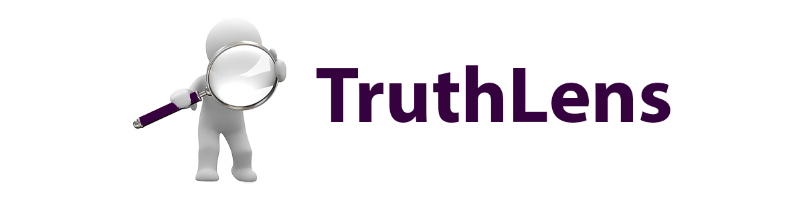
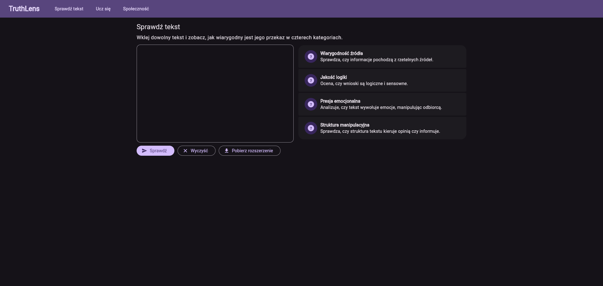
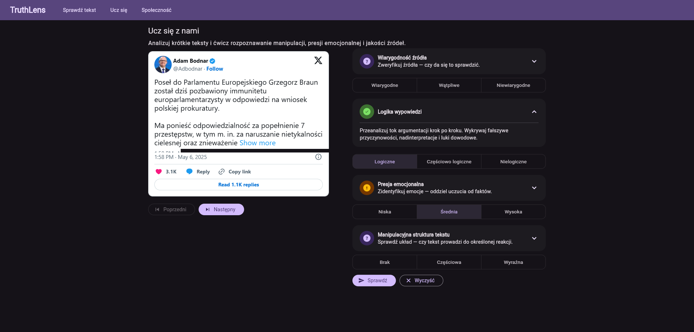
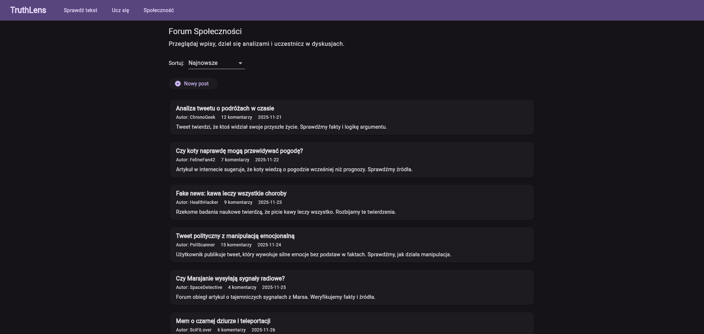
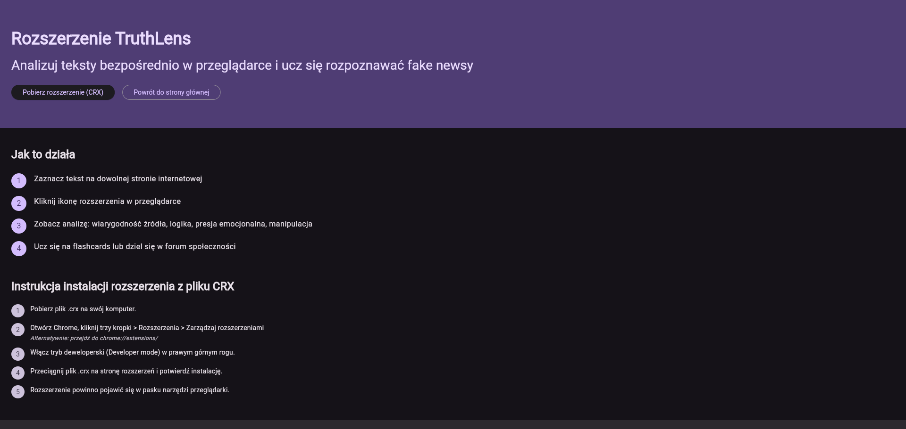
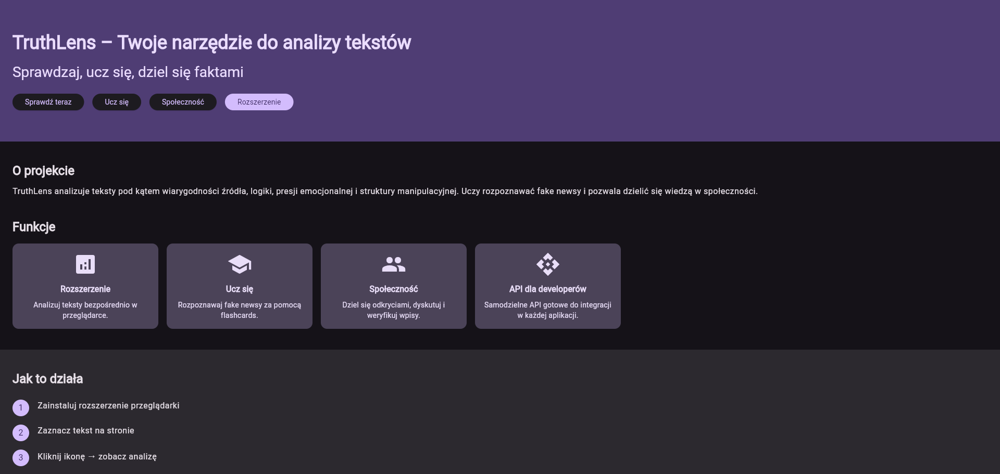

# TruthLens



**TruthLens** to narzędzie oparte na sztucznej inteligencji, stworzone w celu automatycznej oceny wiarygodności tekstów w Internecie i walki z dezinformacją. Składa się z trzech głównych elementów:

1. **Rozszerzenie przeglądarkowe** – umożliwia natychmiastową analizę zaznaczonego tekstu na dowolnej stronie internetowej, ocenianą pod kątem wiarygodności źródła, jakości logiki, presji emocjonalnej i manipulacji strukturalnej.
2. **API** – pozwala na integrację z systemami zewnętrznymi, umożliwiając ocenę treści na podstawie kontekstu z wyszukiwania w Google oraz analizę za pomocą AI (Gemini-2.5).
3. **Serwis webowy** – centralna platforma do analizy tekstów, edukacji oraz wspierania użytkowników w samodzielnej weryfikacji informacji. Umożliwia również dzielenie się analizami w ramach społeczności, gdzie użytkownicy mogą wspólnie identyfikować dezinformację, a także uczestniczyć w dyskusjach na forum.

Całość opiera się na nowoczesnych technologiach, takich jak Flutter, Dart i Python, zapewniając skalowalność i możliwość łatwej rozbudowy w przyszłości.

## Rozszerzenie Przeglądarkowe

Rozszerzenie TruthLens umożliwia szybką analizę zaznaczonego tekstu na dowolnej stronie internetowej. Użytkownik zaznacza fragment tekstu, klika ikonę rozszerzenia i otrzymuje kompleksowy raport analizy wiarygodności. Jest to idealne narzędzie do weryfikacji informacji w czasie rzeczywistym podczas przeglądania sieci.

### Funkcjonalności
- **Analiza tekstu**: Rozszerzenie łączy się z API (api.truthlens.pl), wysyłając zaznaczony tekst do analizy. Raport obejmuje cztery kategorie: wiarygodność źródła, jakość logiki, presja emocjonalna oraz struktura manipulacyjna.
- **Wyświetlanie wyników**: Wyniki prezentowane są w intuicyjnym interfejsie, z krótkimi i długimi opisami dla każdej kategorii i statusem (verified, questionable, false_info).
- **Język analizy**: Analiza zwracana jest w języku oryginalnego tekstu.

### Technologie
- Zbudowane na Flutter z Dart (wersja Flutter 3.38.0, Dart 3.10.0).
- Kompatybilne z przeglądarkami opartymi na Chromium (np. Google Chrome, Microsoft Edge). Nie testowane na Firefox.

### Instalacja i Uruchomienie
1. **Budowanie**: W katalogu `/ext` uruchom komendę:
   ```
   flutter build web --no-web-resources-cdn --pwa-strategy=none --wasm
   ```
   Spowoduje to wygenerowanie folderu `build/web`, który zawiera pliki rozszerzenia.
2. **Instalacja lokalna**: 
   - W przeglądarce Chrome przejdź do `chrome://extensions/`.
   - Włącz tryb deweloperski (Developer mode).
   - Wybierz "Load unpacked" i wskaż folder `build/web`.
   - Alternatywnie, na stronie www.truthlens.pl w sekcji "Rozszerzenie" dostępny jest plik .crx do bezpośredniego pobrania i instalacji (postępuj zgodnie z instrukcją na stronie).
3. **Użycie**: Po instalacji zaznacz tekst na stronie, kliknij ikonę rozszerzenia i zobacz wyniki.


Rozszerzenie jest w pełni funkcjonalne i gotowe do użycia. Link do pobrania: [Dostępne na stronie www.truthlens.pl w sekcji "Rozszerzenie"](https://www.truthlens.pl/#/extension).

## API

API TruthLens stanowi rdzeń projektu, obsługując zapytania analizy tekstu. Jest dostępne pod adresem [api.truthlens.pl](https://api.truthlens.pl/) i wykorzystuje model AI Gemini-2.5-flash do oceny wiarygodności. API wyszukuje informacje za pomocą Google Custom Search, budując kontekst weryfikacji.

### Funkcjonalności
- **Analiza tekstu**: Przetwarza tekst w czterech kategoriach: Wiarygodność źródła, Jakość logiki, Presja emocjonalna, Struktura manipulacyjna. Zwraca podsumowanie (summary), status przetwarzalności (processable) oraz szczegółowe czynniki (factors).
- **Kontekst weryfikacji**: Dla każdej analizy budowany jest kontekst z wyników wyszukiwania Google, uwzględniający aktualną datę i ramy czasowe.
- **Schemat odpowiedzi**: API zwraca JSON. Istnieją dwa warianty:
  - **Gdy processable: false** (tekst nie nadaje się do analizy):
    ```json
    {
      "processable": false,
      "reason": "Tekst jest zbyt krótki lub nie zawiera twierdzeń do weryfikacji."
    }
    ```
  - **Gdy processable: true** (pełna analiza):
    ```json
    {
      "summary": "Krótki opis głównego twierdzenia w języku oryginalnym.",
      "processable": true,
      "factors": {
        "source_reliability": {
          "status": "verified",
          "short": "Źródło jest wiarygodne.",
          "long": "Szczegółowe wyjaśnienie w języku oryginalnym (do 50 słów).",
          "sources": [
            {
              "title": "Tytuł źródła",
              "snippet": "Krótki fragment",
              "displayLink": "example.com",
              "link": "https://example.com"
            }
          ]
        },
        "logic_quality": {
          "status": "questionable",
          "short": "Logika jest wątpliwa.",
          "long": "Szczegółowe wyjaśnienie w języku oryginalnym (do 50 słów)."
        },
        "emotional_pressure": {
          "status": "false_info",
          "short": "Wysoka presja emocjonalna.",
          "long": "Szczegółowe wyjaśnienie w języku oryginalnym (do 50 słów)."
        },
        "manipulative_structure": {
          "status": "verified",
          "short": "Brak manipulacji strukturalnej.",
          "long": "Szczegółowe wyjaśnienie w języku oryginalnym (do 50 słów)."
        }
      }
    }
    ```
    Pole `sources` jest dostępne tylko dla `source_reliability` i zawiera do 3 zasobów (tytuł, snippet, displayLink, link). Źródła pochodzą z kontekstu weryfikacji.

### Technologie
- Python 3.13.0.
- Biblioteki: Zdefiniowane w `requirements.txt`.
- Model AI: Gemini-2.5-flash.
- Wyszukiwanie: Google Custom Search API.

### Konfiguracja
- **Zmienne środowiskowe**: Ustaw w pliku `.env`:
  ```
  GEMINI_API_KEY=twój_klucz_gemini
  SEARCH_API_KEY=twój_klucz_google_search
  SEARCH_ENGINE_ID=twój_id_silnika_google
  ```
- **Autoryzacja**: API nie wymaga autoryzacji dla zapytań (brak klucza użytkownika). Klucze powyżej służą do wewnętrznej konfiguracji usług Google.
- **Limity użycia** (free tier):
  - Google Custom Search: 100 zapytań dziennie.
  - Gemini-2.5-flash: Nielimitowane tokeny wejściowe dziennie, 250 żądań dziennie na projekt.

### Uruchomienie
W katalogu `/api`:
1. Zainstaluj zależności: `pip install -r requirements.txt`.
2. Uruchom serwer: `uvicorn main:app --host 127.0.0.1 --port 8000 --reload`.

### Przykładowe Zapytanie
- **CURL**:
  ```
  curl -X POST https://api.truthlens.pl/ \
  -H "Content-Type: application/json" \
  -d '{"query": "Przykładowy tekst do analizy."}'
  ```

API jest w pełni funkcjonalne. Adres: [api.truthlens.pl](https://api.truthlens.pl/).

## Serwis Webowy

Serwis TruthLens dostępny pod adresem [www.truthlens.pl](https://www.truthlens.pl) to centralna platforma projektu. Zbudowany na Dart i Flutter, może być łatwo skompilowany na aplikacje mobilne (Android/iOS). Obecnie w fazie prototypu, z pełną funkcjonalnością dla kluczowych modułów.

### Funkcjonalności
- **Sprawdź teraz**: Identyczna analiza tekstu jak w rozszerzeniu, z większą przestrzenią na wyniki (wprowadź tekst ręcznie lub skopiuj).
    
- **Ucz się**: Moduł edukacyjny z fiszkami. Każda fiszka to nagłówek wiadomości, wpis polityka lub post z mediów społecznościowych. Użytkownik analizuje tekst według kategorii, a system sprawdza poprawność, ucząc samodzielnej weryfikacji (np. brak źródła, manipulacja emocjami).
    
- **Społeczność**: Prototyp forum do dyskusji o fejkach i kampaniach dezinformacyjnych. Umożliwia dzielenie się analizami, z rankingiem użytkowników i wpisów (najpopularniejsze z ostatniego tygodnia). Analizy sprawdzane przez AI pod kątem spójności i logiki. Forum ma potencjał SEO – popularne wpisy trafiają do wyników Google, działając jak otwarty demagog pisany przez społeczność. Uwaga: Obecnie, tylko prototyp, nie funkcjonalny w pełni.
    
- **Rozszerzenie**: Sekcja do pobierania rozszerzenia z instrukcją instalacji i użycia.
    
- **Landing**: Strona główna z opisem projektu.
    

### Technologie
- Dart + Flutter (wersja Flutter 3.38.0, Dart 3.10.0).

### Budowanie i Uruchomienie
W katalogu `/app`:
1. Zbuduj wersję web: `flutter build web`.
2. Uruchom lokalnie: Użyj serwera webowego (np. `flutter run -d chrome`) lub deployuj na serwer.

Serwis jest prototypem, z działającymi modułami Check i Educate (ograniczona baza fiszek). Forum to wizja bez pełnej implementacji. Adres: [www.truthlens.pl](https://www.truthlens.pl).

## Podsumowanie i Plany Rozwoju

TruthLens to kompleksowy ekosystem do walki z dezinformacją — od szybkiej analizy tekstu w przeglądarce, poprzez elastyczne API oparte na Gemini-2.5, aż po platformę webową wspierającą edukację i budowanie społeczności świadomych odbiorców informacji.

Obecna wersja projektu oferuje w pełni funkcjonalne rozszerzenie oraz stabilne API, a także działające moduły **Check** i **Educate** w serwisie webowym. Kolejne etapy rozwoju obejmują:

* **Rozbudowę forum społeczności** o pełne funkcje publikacji, moderacji i głosowania.
* **Wersje mobilne** aplikacji (Android/iOS) z natywną integracją z API.
* **System reputacji użytkowników** oparty na jakości analiz oraz aktywności.
* **Zaawansowane modele detekcji manipulacji** z wykorzystaniem hybryd AI i metod OSINT.

TruthLens powstał jako odpowiedź na rosnącą skalę dezinformacji i brak prostych narzędzi dla zwykłego użytkownika internetu. Projekt ma ambicję stać się **codziennym asystentem weryfikacji informacji**, łącząc technologie AI z edukacją społeczną i współpracą użytkowników.